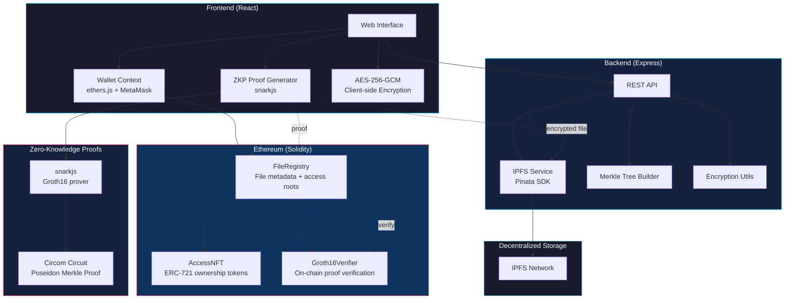

[](https://github.com/salim-lakhal/zkp-decentralized-storage/actions)


# ZKP Decentralized Storage

A decentralized file storage platform that combines **IPFS** for content-addressed storage, **Zero-Knowledge Proofs** for privacy-preserving access control, and **NFT-based ownership** via Ethereum smart contracts.

Files are encrypted client-side before uploading to IPFS. Access is controlled by a Merkle tree of authorized users — anyone in the tree can generate a ZKP (Groth16) proving membership **without revealing their identity**. The proof is verified on-chain, and only valid provers can retrieve the decryption key.

## Architecture



## How It Works

### Upload Flow
1. User selects a file in the browser
2. File is encrypted with **AES-256-GCM** (key derived from wallet address + file hash via PBKDF2)
3. Encrypted blob is pinned to **IPFS** via Pinata, returning a content-addressed CID
4. Smart contract stores the CID + an initial access Merkle root
5. An **ERC-721 NFT** is minted to the uploader, representing file ownership

### Access Flow
1. File owner builds a Merkle tree of authorized wallet addresses
2. The Merkle root is stored on-chain via `updateAccessRoot()`
3. An authorized user generates a **Groth16 ZKP** proving their address is a leaf in the tree — without revealing *which* leaf
4. The proof is verified on-chain by `Groth16Verifier`
5. If valid, the user can retrieve and decrypt the file

### Why ZKPs?

Traditional access control reveals who accessed what. With ZKPs, the verifier only learns that the requester is *some* authorized user — not which one. This provides:

- **Identity privacy**: access logs don't leak user identity
- **Minimal disclosure**: prove authorization without exposing the full access list
- **On-chain verification**: trustless, no centralized access control server

## Smart Contracts

| Contract | Purpose |
|----------|---------|
| `FileRegistry.sol` | Core registry — stores encrypted CIDs, file name hashes, access Merkle roots. Coordinates NFT minting/burning and ZKP verification. |
| `AccessNFT.sol` | ERC-721 tokens representing file ownership. Only the FileRegistry can mint/burn. Token URI resolves to `ipfs://<CID>`. |
| `Groth16Verifier.sol` | On-chain Groth16 proof verification using BN254 pairing checks (precompiles at addresses 6, 7, 8). 2 public inputs: Merkle root + leaf hash. |

### Key Design Decisions

- **Ownership via NFT ownership, not storage mapping**: The `onlyFileOwner` modifier checks `accessNFT.ownerOf()` on every call, so transferring the NFT transfers file ownership automatically.
- **CREATE address prediction**: Deploy script predicts the `FileRegistry` address before deployment using `getCreateAddress()`, allowing `AccessNFT` to set the registry as its `Ownable` owner in a single transaction flow.
- **Custom errors over require strings**: Gas-efficient revert reasons (`InvalidCID()`, `Unauthorized()`, etc.).
- **ReentrancyGuard on state-changing operations**: Upload and delete are protected against reentrancy via OpenZeppelin's `ReentrancyGuard`.

## ZKP Circuit

The Merkle proof circuit (`circuits/merkle_proof.circom`) proves membership in a depth-20 Poseidon Merkle tree:

```
Private inputs: leaf, pathElements[20], pathIndices[20]
Public inputs:  root

Constraint: hash(leaf, path) == root
```

- Uses **Poseidon hash** (~250 constraints per level vs ~25k for SHA-256)
- Binary constraint on path indices prevents proof forgery
- Supports ~1M users per access tree

See [circuits/README.md](circuits/README.md) for build instructions.

## Project Structure

```
├── contracts/              # Solidity smart contracts
│   ├── FileRegistry.sol    # Core file registry + access control
│   ├── AccessNFT.sol       # ERC-721 file ownership tokens
│   └── Groth16Verifier.sol # On-chain ZKP verification
├── circuits/               # ZKP circuits (circom)
│   ├── merkle_proof.circom # Merkle tree membership proof
│   └── build_circuit.sh    # Circuit compilation + key generation
├── backend/                # Express API
│   ├── routes/files.js     # IPFS upload/download via Pinata
│   ├── routes/proof.js     # ZKP proof generation + verification
│   ├── routes/access.js    # Merkle tree management
│   └── utils/              # Encryption + Merkle tree utilities
├── frontend/               # React application
│   ├── src/pages/          # Landing, Dashboard, Upload, Files, Access Control
│   ├── src/services/       # IPFS, contract, ZKP service layers
│   └── src/context/        # Wallet connection context (ethers.js)
├── scripts/deploy.js       # Hardhat deployment script
├── test/                   # Contract tests (41 tests)
└── hardhat.config.js       # Hardhat configuration
```

## Setup

### Prerequisites

- Node.js 20+
- MetaMask browser extension
- [Circom](https://docs.circom.io/getting-started/installation/) (for ZKP circuit compilation)

### Install

```bash
git clone https://github.com/salim-lakhal/zkp-decentralized-storage.git
cd zkp-decentralized-storage

# Root (contracts + Hardhat)
npm install

# Frontend
cd frontend && npm install && cd ..

# Backend
cd backend && npm install && cd ..
```

### Environment Variables

Copy `.env.example` to `.env` and fill in your keys:

```bash
cp .env.example .env
```

| Variable | Description |
|----------|-------------|
| `PINATA_JWT` | Pinata API JWT for IPFS pinning |
| `INFURA_PROJECT_ID` | Infura project ID for Ethereum RPC |
| `PRIVATE_KEY` | Deployer wallet private key (for testnet) |

### Run Locally

```bash
# Start local Hardhat node
npm run node

# Deploy contracts (in another terminal)
npm run deploy:local

# Start backend
npm run backend:start

# Start frontend
npm run frontend:start
```

### Run Tests

```bash
# Smart contract tests (41 tests)
npm test

# Frontend build check
npm run test:frontend
```

## Tech Stack

| Layer | Technology |
|-------|-----------|
| Smart Contracts | Solidity 0.8.24, OpenZeppelin 5.x, Hardhat |
| ZKP | Circom 2.0, snarkjs (Groth16), Poseidon hash |
| Storage | IPFS via Pinata, AES-256-GCM client-side encryption |
| Backend | Node.js, Express, ethers.js |
| Frontend | React 18, ethers.js v6, React Router |
| Testing | Hardhat + Chai (41 contract tests) |
| CI/CD | GitHub Actions |

## License

[MIT](LICENSE)
